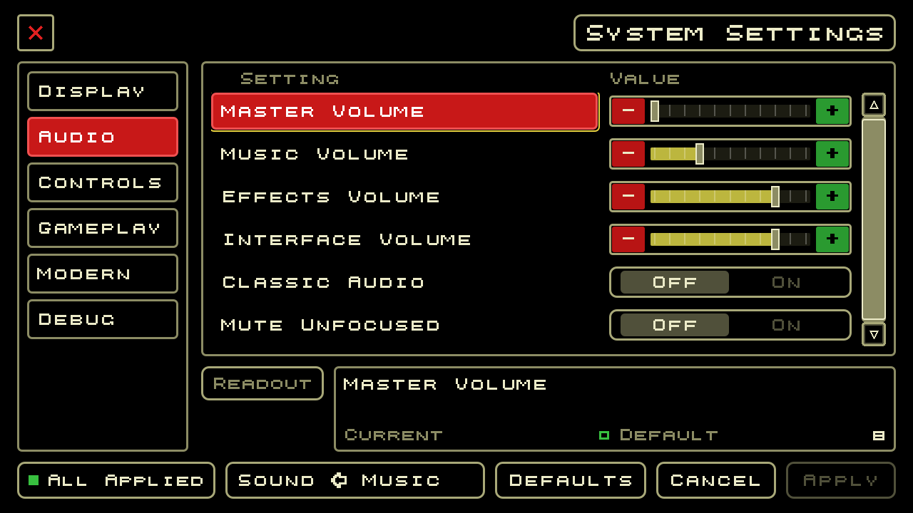
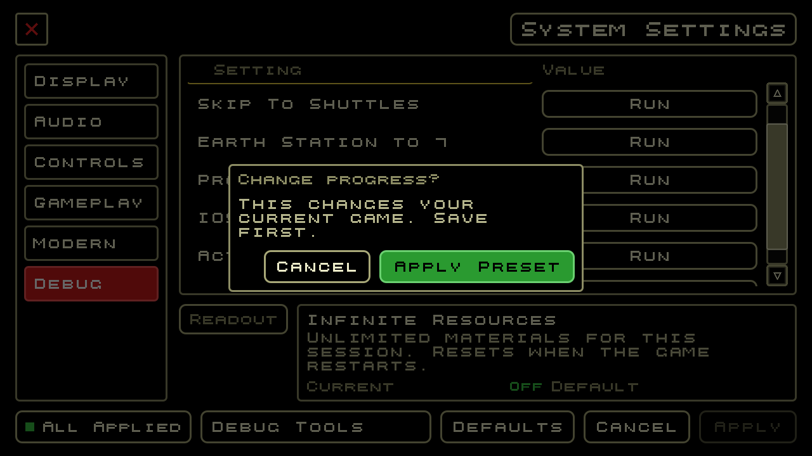

# Upstream integration results — 2026-10-07

The local candidate combines contribution runtime `20ce403` with upstream `develop` at `942d993`. All 17 merge conflicts are resolved. This is a local contribution-branch integration, not a merge to the default branch or Windows acceptance.

## Behavior retained and combined

- Use upstream's centered 320×200 game viewport and full-resolution Settings screen, with Apply/Discard, audio buses and key-map configuration. Music, Effects and Interface feed Game, preserving SDM alarm priority.
- Preserve legacy audio/display preferences, malformed-value guards, save-error feedback, session-only cheats, preset confirmation, crew-capacity preflight and repeat-safe progression shortcuts. Legacy audio percentages convert to the new ten-step slider; small legacy windows respect the new 1280×720 settings minimum. SettingsManager owns application/disposal of preferences.
- Route right-click navigation from inside the game viewport after screen modal handlers. Keep cancellation, input ownership and shutdown cleanup when timers pause with the game.
- Keep the original-backed AlienTransmissions controller and its saved state/order. Remove upstream's duplicate scheduler, fields and unused message enum entries; the old saved enum values remain stable. Read-only review found no upstream active-game save producer requiring a speculative conversion.
- Allow optional click-to-complete bulletin typing without bypassing pause, acknowledgement or another owner's input lock. Preserve the original recovered message bodies and ACC lamp behavior.

## Verification and limits

Pinned Godot 4.2.2 .NET and SDK 6.0.428 build with 14 existing warnings and zero errors. Strict asset import and startup smoke pass. All 19 Python tooling checks pass, with the original ending disk supplied and no skips.

The initial fresh-process pass ran 635 cases in 1,075.6 seconds: **625 passed and 10 failed**. Its tested tree is `e815e8a70b902b1ee1bfd6d8caaeb77ae91ec1a7`. The failures exposed outdated test coordinates after the viewport move: nine cargo-pointer checks applied the game transform twice to window-space overlay positions; the error-dialog test still expected the old window bounds. Those tests were corrected, and **all 23 targeted headless cases pass**, including all ten failures, settings lifecycle/presets and bulletin skipping. Across those retained logs all 635 cases have passing evidence. At that checkpoint this was aggregate evidence; the subsequent complete run below closes that gap. Subsequent runtime cleanup only removed unused legacy preference-application methods; native framebuffer tests now transform game coordinates into final-window pixels.

**19 distinct native cases pass in 20 runs**, including settings Apply/Discard and fullscreen/default restoration, keyboard conflict swapping and Escape, modal right-click ordering, trade/cargo hit testing, centered error boxes, actual window-close teardown, training-light pixels, construction/research art, orbital views, production rods, ACC palette animation and bulletin skipping. Screenshots were inspected for settings and six-cargo overlay layout.

Manual native check: enter the fresh game, open Settings with Escape, preview music volume from 8 to 7, press Escape, Discard, reopen and observe 8 with All Applied. Closing the OS window while Settings remained open exited 0 with a clean log. User saves/preferences were byte-for-byte unchanged; no campaign save was loaded or advanced.

The Windows cross-export is **164,121,808 bytes**, SHA-256 `5132d64983c7282f3cc44ca130b1bd041b36c001bdfe3d5d7f9546a39d5ff3e6`. All 1,259 embedded payload hashes pass; the pack includes the new settings/game-input assembly, 64 recovered illustration imports, original ending sequence/music and .NET dependencies, with no test resources or removed old Settings scene. Runtime DLL SHA-256: `3be3e1e7b916abb7ddaa27564d9d493a8a31d9d638177573cca99e56e33f3046`. **This executable has not been run or accepted on Windows.**

Evidence is retained inside the isolated worktree at `artifacts/upstream-integration/`: `full-first/` (original failures and source patch), `corrected/`, `native/`, `manual/`, `windows/`, `audit.json` and `coverage.json`. Original failed logs remain intact.

## Complete final-source run — 2026-10-07

A fresh validation at committed source `365b0a6dafb81a046e3e24473fe9beb9bddf48b9` now passes **635/635 cases in one run**, build, strict import and startup smoke. The owned validator exits **0**. Every case log was independently checked for its pass marker and forbidden error diagnostics, including case 264; the existing narrow editor-only exception is unchanged. No runtime, tests, timeout or validator filters changed during the run.

The only temporary project override selected the separate `Deuteros-validation635-20261007` user-data directory, allowing protected-save normal campaign play to continue independently. Original project SHA-256 `f6120cd690eb5024729e6133493870125cdc09855b366cf6af87c1f93d0e79db` is restored and the isolated worktree is clean. Main checkout `5fd3c8a` has identical `Godot` and `scripts` trees. This run does not repeat the unchanged Windows export or the earlier 19 tooling checks.

Evidence: `artifacts/worktrees/upstream-integration/artifacts/upstream-integration/full-final/`, containing `run.log`, `results/`, source/profile hashes, `result.json` and runnable `audit.py`. All earlier failing runs remain intact. This is current full Mac regression evidence, not Windows execution or proof that intermittent shutdown faults are resolved.

## Still open

Upstream exposes settings rows without gameplay consumers: pixel scaling, scanlines, interface scale, classic audio, edge scroll, pointer speed and the gameplay options. Research and Production now navigate through enabled menu actions, with [regression and physical rebinding evidence](validation-results.md#research-and-production-keyboard-navigation--2026-10-07). Speed Up/Down now select existing fast/normal time with [focused, native and physical rebinding checks](validation-results.md#speed-up-and-slow-down-keyboard-controls--2026-10-07). Pause now opens/resumes the existing Settings screen with [pending-change and pause-ownership protection](validation-results.md#pause-binding-and-settings-ownership--2026-10-07). Next Location now cycles accessible stations with [regression and physical Tab/N evidence](validation-results.md#next-location-keyboard-navigation--2026-10-08). Quick Save still has no action handler. Their UI presence is not completed feature evidence.

The 48-task goal remains at **35/48 with implementation evidence and four locally accepted requirements**. Normal campaign/SCG/ending acceptance, Windows acceptance, original-fidelity gaps and the retained Mac/Windows shutdown failures remain open. Passing this integration does not establish their resolution. The day-15901 full-fleet funding checkpoint and earlier failed campaign branches are unchanged.

